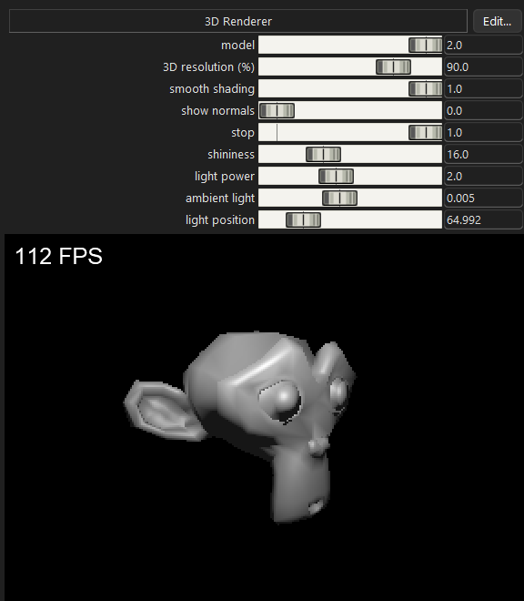

# 3D Renderer Example
This is a simple 3D renderer with 3 different models, smooth shading, Blinn-Phong lighting, and depth buffering.

This can be compiled by running the compiler on the `Main.scy` file. For more instructions, see this repo's [README](https://github.com/maks-ymilian/scythe/blob/main/README.md#usage).

